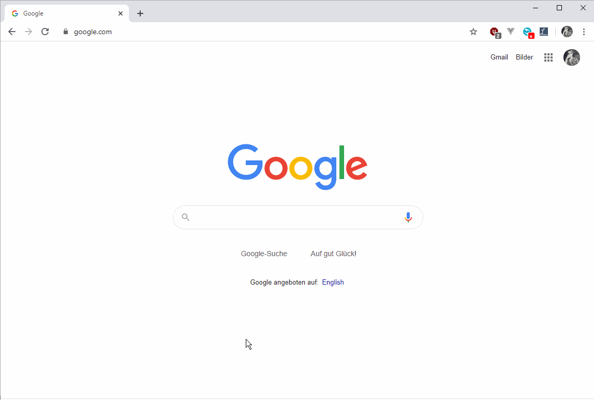

# Linguee Translate
Chrome extension for quick translations between german and english.
Powered by [Linguee.com](https://linguee.com).

Scaffold created with [Yeoman](https://github.com/yeoman/generator-chrome-extension/).


## Use

Quickly search for translations between german and english by typing. Results will be updated as you type.
Press ENTER to see the results on Linguee.com.

Default Shortcut: CTRL+SHIFT+L (Windows, Linux); CMD+SHIFT+L (Mac)


## Develop
```
# set up:
npm install

# Compile source (Babel)
gulp babel

# Use watch to update source continuously
gulp watch

# production build
gulp build
```

### Testing
Not set up (yet. maybe never.)